```{r Setup}
#| include: false

# DIME template:
source("_extensions/dime/setup_dime_palettes.R")
source("_extensions/dime/setup_ggplot2_dime.R")
```

# Motivation and fundamentals

## DIME Analytics Code and Data Recommendation

<hr>

:::: {.columns}
::: {.column width="50%"}
**DATA**
 
Keep a pristine immutable backup of original data.
 
Create any derivative data sets and output using code from this data.
:::
::: {.column width="50%"}
**CODE**

Version control all edits to your code using Git.

This indirectly version controls all derivative data sets and output.

:::
::::

<hr>

More training sessions for Git/GitHub:

- Join the contributor training during MSFR on Friday, June 13 at 9am ET.
- We will after MSFR announce a round of contributor sessions this summer

<hr>

## Why use Git/GitHub?

:::: {.columns .v-center-container}

::: {.column width="57%"}
Git is the gold-standard tool to take full control over a project's code files.

No team that works with code should spend significant time on file management.

Be able to browse, review and common on any code contribution made by anyone in the project - as a TTL, you should love this!

Git/GitHub provides several tools for quality-assurance that will make your project's code better.
:::

::: {.column width="43%"}

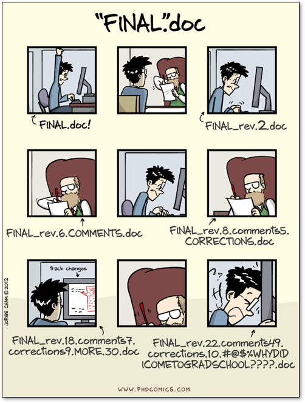{fig-align="right"}
:::
::::

## Git, GitHub and Git Clients

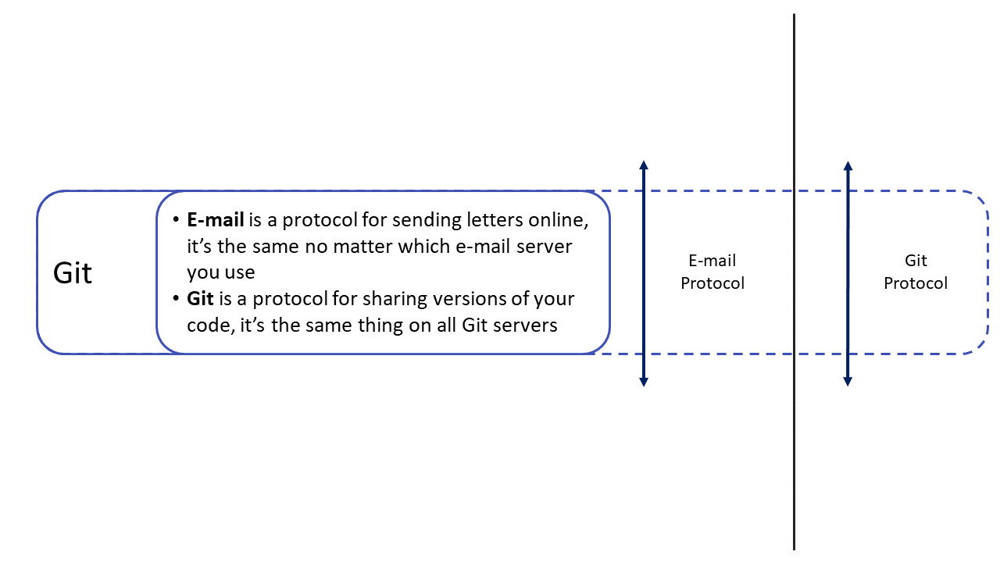{fig-align="center"}

## Git, GitHub and Git Clients

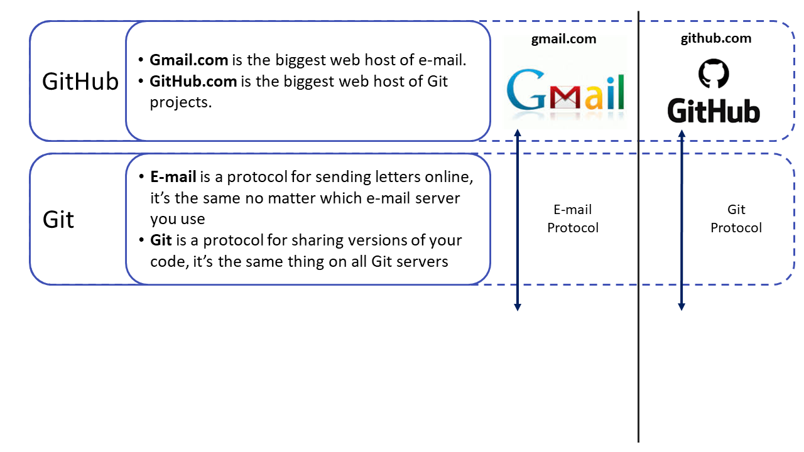{fig-align="center"}

## Git, GitHub and Git Clients

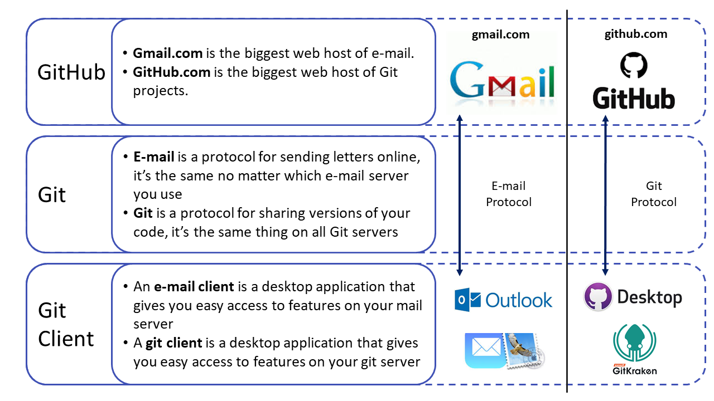{fig-align="center"}


## Vocabulary and examples

:::: {.columns .v-center-container}

::: {.column width="50%"}

- A project folder in Git/GitHub is called a "_**repository**_" – or just _**repo**_.
- Repos are hosted on GitHub organization accounts. Users are given access through personal GitHub accounts.
- All collaborators have a copy of the repo on their computer – this is called a _**clone**_.
- You can review and observe in the browser, and then you do not need a clone.
- All examples in this session are from this repository: [https://github.com/dime-wb-trainings/prwp-ttl](https://github.com/dime-wb-trainings/prwp-ttl).

:::
::::

## GitHub Organization Accounts

:::: {.columns .v-center-container}

::: {.column width="45%"}

Two organization accounts where we can host our repos:

- https://github.com/worldbank 
- https://github.com/dime-worldbank

Guides for all actions (get or grant access, create a repo etc.) on the dime-worldbank landing page
:::

::: {.column width="55%"}
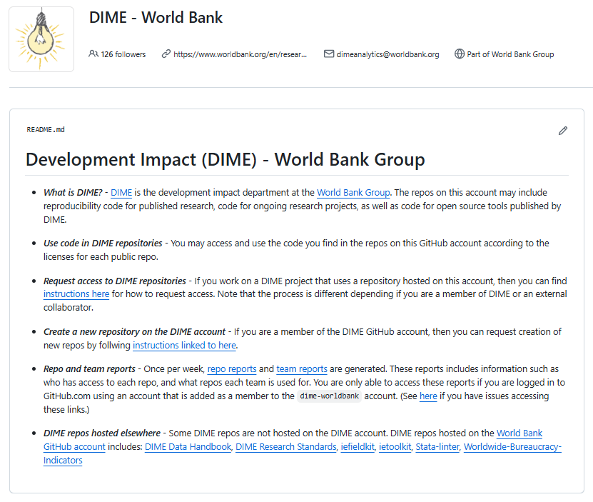{fig-align="center"}
:::

::::

# Version control

## Commits

:::: {.columns .v-center-container}
::: {.column width="70%"}
Version control is not unique to Git. But Git's version control is very efficient.

Instead of saving the full file for each version (very inefficient), Git only saves the difference from the previous version (very efficient).

Git tracks these difference from the previous version line-by-line and combine them in "**_commits_**". This is the central building block in Git. 

A commit can be a single line-by-line difference or multiple differences in a single file or across files.

The team member writing the code decides what they want to combine into a commit to be shared with the rest of the team.

:::

::: {.column width="10%"}
:::

::: {.column width="10%"}
{fig-align="center"}
:::
::::


## Gives access to **all** historic versions

:::: {.columns .v-center-container}
::: {.column width="70%"}

Since commits in Git are so efficient, all historic versions of your project is stored on GitHub and in your clone - without taking up significant disk space.

You can use Git "_**check-out**_" the state of your code at the time of any historic commit.

OneDrive, DropBox etc. also has version control. But they save a full new version of a file for each edit. Therefore, even if you have the most expensive enterprise subscription, old versions will eventually be permanently deleted.

To keep historic versions in OneDrive/DropBox, you must save different versions of the same file with a slightly different name. This is messy, and will eventually not make sense to other team members in the future.
:::

::: {.column width="10%"}
:::

::: {.column width="10%"}
{fig-align="center"}
:::
::::

## GitHub is very clickable and linkable

:::: {.columns .v-center-container}
::: {.column width="70%"}
On GitHub, each commit is given a unique URL - enabling easy and unambiguous conversation about code. 

These links are permanent and will forever show the edits in a specific commit.

See this example [here](https://github.com/dime-wb-trainings/prwp-ttl/commit/a83c7ef80c4cfe5a57d845c62872f4ea9253c98d).

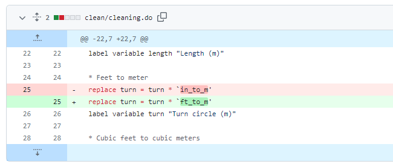{fig-align="center"}

:::

::: {.column width="10%"}
:::

::: {.column width="10%"}
{fig-align="center"}
:::
::::

## A commit is a snap shot of the full project

:::: {.columns .v-center-container}
::: {.column width="50%"}

Every commit is on the project level. This means that a commit includes the difference in all project files relative the previous commit.

If you check-out an old commit, Git restores all files in the project folder to that version.

See this example [here](https://github.com/dime-wb-trainings/prwp-ttl/commit/05d71bce58f4c2d6cbc55b02c0b6666aa9273427).

:::

::: {.column width="50%"}
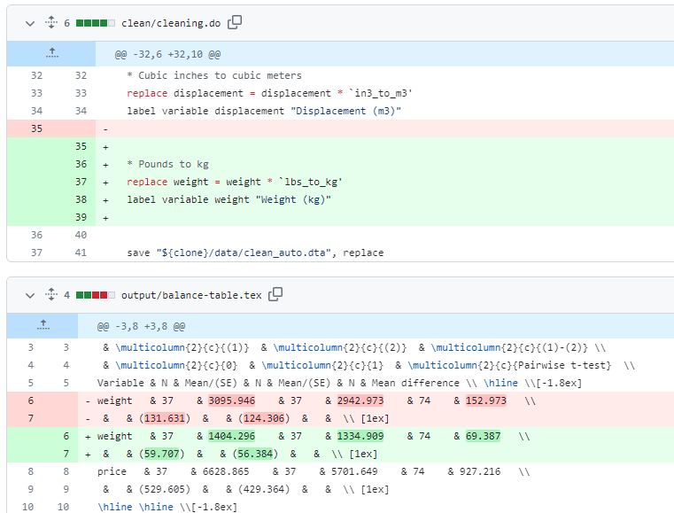{fig-align="center"}
:::
::::

## Labels/Releases

:::: {.columns .v-center-container}
::: {.column width="55%"}

You can label commits you think will be especially important for you or someone else in the future.

You can label a commit with anything you want. Software are often labeled as `v1.0`, `v13.2.14` etc. but we can label it anything we want. `baseline-report`, `prwp-submission`, `RA-Bob-handhover` etc.

This creates a reliable way to know exactly what code that generated which report and where submitted to something, at any point in the future.

See example [here](https://github.com/worldbank/rio-safe-space/releases/tag/WP).

:::

::: {.column width="45%"}
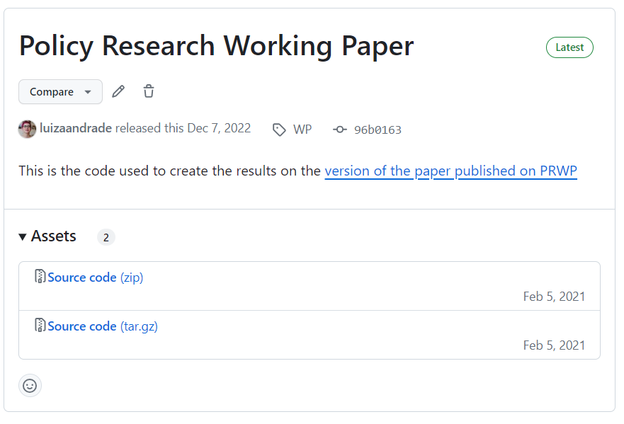{fig-align="center"}
:::
::::


## GitHub is very clickable and linkable

:::: {.columns .v-center-container}
::: {.column width="35%"}
It is also [possible](https://stackoverflow.com/a/63940108/6889416) to show the sum of the differences in multiple commits.

See this example [here](https://github.com/dime-wb-trainings/prwp-ttl/compare/bc4dcc1210ad2f8c419139af023744dbc967aacc..c88cbc8f2007943564b8eff34a624a04600a7f65).
:::

::: {.column width="55%"}
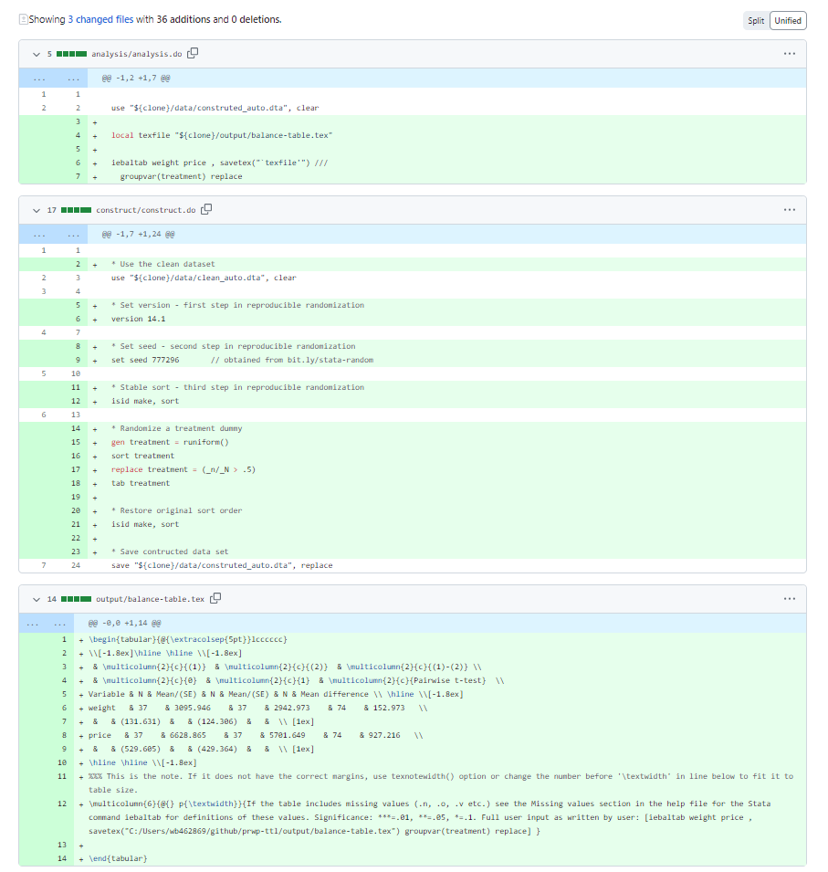{fig-align="center"}
:::

::: {.column width="10%"}
{fig-align="center"}
:::
::::

# Git Clients

## GitHub Desktop

:::: {.columns .v-center-container}
::: {.column width="55%"}

A Git Client is a software that allows you to package your edits into commits. Many alternatives exists.

We strongly recommend everyone using a GUI Git Client such as [GitHub Desktop](https://desktop.github.com/) (top picture). 

Unless you are a computer scientists, do not use the CLI tool (bottom picture) until you are an advanced Git user (if ever).

Since Git is a standardized protocol, collaborators on the same project may use different Git Clients.

:::

::: {.column width="45%"}

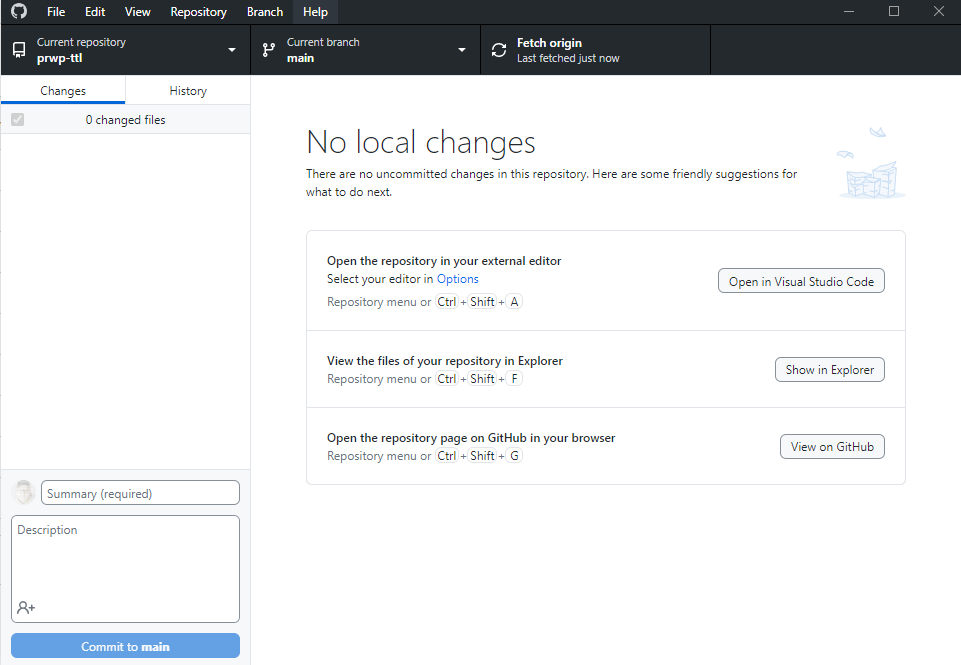{fig-align="center"}

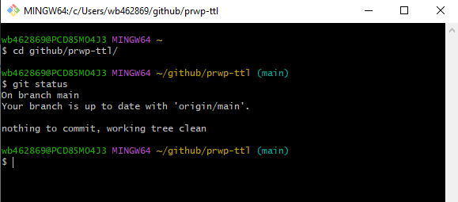{fig-align="center"}
:::
::::

## Git Clone

:::: {.columns .v-center-container}
::: {.column width="68%"}

**Do not save clones in a folder that is synced in OneDrive, Dropbox etc.** Those collaboration tools work different and sometimes corrupt how Git shares content.

On your computer, the files in the clone of the repository will looks and behaves like a regular project folder. 

Work with the code files exactly how you usually do without Git.

Edits are only committed and shared when the human decides to do so. **Collaboration with intent!**

:::

::: {.column width="5%"}
:::

::: {.column width="27%"}
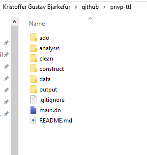{fig-align="left"}
:::
::::


## Curate your code before committing it

:::: {.columns .v-center-container}
::: {.column width="45%"}

GUI Git Clients helps you curate your code such that you are in full control what lines of codes are shared with the team.

Files are not synced on every edit, and we get to curate our edits before sharing. **This liberates team's creativity!**

Experiment with your code, add excessive print statements, and discard code you don't want to share with a click of a button.
:::

::: {.column width="5%"}
:::

::: {.column width="50%"}

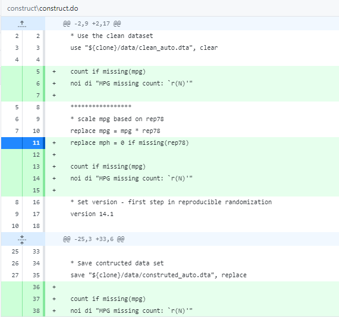{fig-align="left"}
:::
::::

# Collaboration

## Branches

:::: {.columns .v-center-container}
::: {.column width="70%"}

Commits allows us to jump to older versions of the code, "_**branches**_" allows us to jump to parallel versions of the code.

Commits "_**pushed**_" to one branch does not impact other branches. Yet another way to unleash our creativity as we can experiment in a parallel version, and if not successful we discard the branch without "_**merging**_" them to the "_**main**_" branch.

Makes instructions like "_Please do not touch any files in this folder while I am working on them_" obsolete.
:::

::: {.column width="10%"}
:::

::: {.column width="10%"}
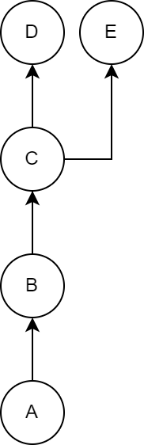{fig-align="center"}
:::
::::

## Review features

:::: {.columns .v-center-container}
::: {.column width="50%"}

_Git/GitHub: Come for the version control, stay for the review features!_

Right before merging is an excellent time to review code. GitHub has therefore developed many excellent review tools for that stage.

* Discuss any line of code
* Make suggestions directly to the code that the author can easily accept or rejct.

See this example [here](https://github.com/dime-wb-trainings/prwp-ttl/pull/1/files#).
:::

::: {.column width="50%"}
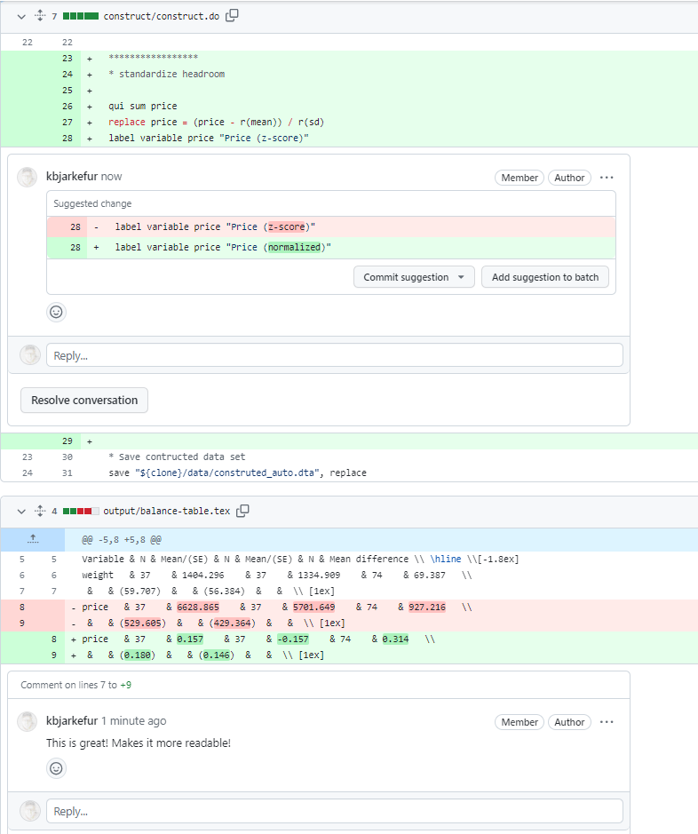{fig-align="center"}

:::
::::

## GitFlow

:::: {.columns .v-center-container}
::: {.column width="70%"}

Git does not require that you use branches in any particular way. 

Instead, there are two well-established and popular work-flow principles. Best suited for research projects with well-reviewed infrequent publications is: [GitFlow](https://www.atlassian.com/git/tutorials/comparing-workflows/gitflow-workflow).

* Never work in the "_**main**_" branch - unless editing meta-files such as READMEs.

* Work in a "_**feature**_" branch for small tasks. When code works in that branch, review and merge to main.

* For larger tasks, split large tasks into smaller task solved in feature branches. Merge these into a "_**dev**_" branch until the large task is solved. Then, thorough review and merge to main.

:::

::: {.column width="30%"}
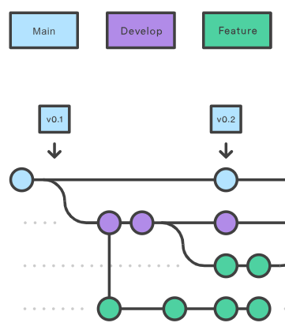{fig-align="center"}

:::
::::


## Network graph

:::: {.columns .v-center-container}
::: {.column width="70%"}

GitHub repositories have real-time network graphs that are live and update whenever the repo changes. 

This is an excellent place to have an overview of what is going on in the project.

See this example [here](https://github.com/dime-wb-trainings/prwp-ttl/network).

{fig-align="center"}
:::

::: {.column width="10%"}
:::

::: {.column width="10%"}
{fig-align="center"}
:::
::::


# Optimized for code

## Raw text files

:::: {.columns .v-center-container}
::: {.column width="40%"}

Git is optimized for raw text files. 

All code, no matter language, is always raw text files. But so is also formats like `.tex`, `.md`, `.qmd`, etc.

The opposite is binary files. It includes all media files, Microsoft Office docs, PDF, etc.
:::

::: {.column width="20%"}
:::

::: {.column width="40%" .h-center-container}

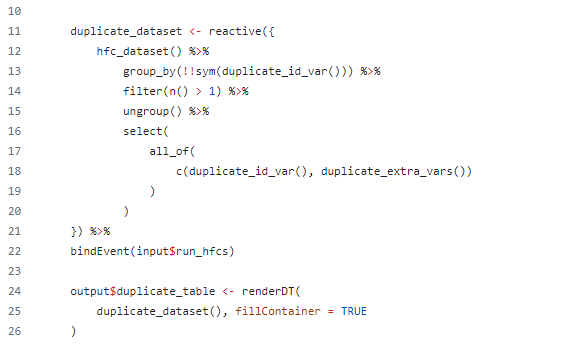{fig-align="center"}

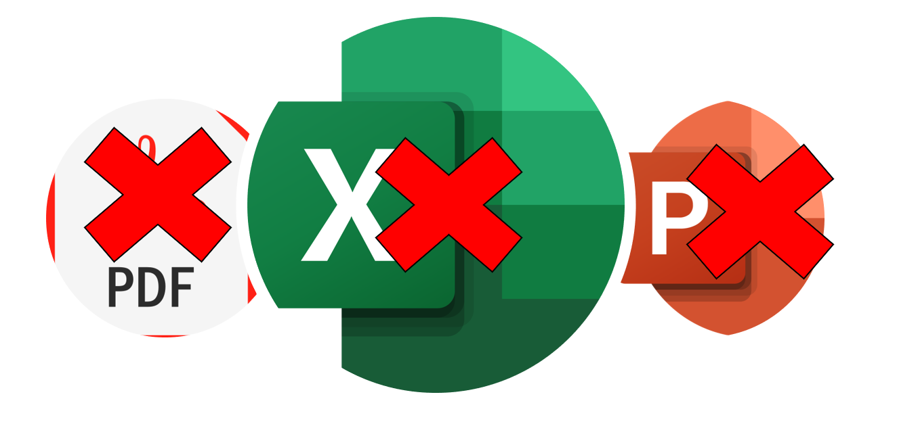{fig-align="center"}
:::
::::


## Binary files

:::: {.columns .v-center-container}
::: {.column width="60%"}

Git _can_ handle binary file, but only in the same inefficient way as OneDrive/DropBox. 

Since all commits are saved in your clone, tracking binary files risks making the clone so big no regular computer can handle them.

All repos created by DIME analytics comes with an "_**ignore file**_" that prevents binary files to be tracked by Git even if they are saved in the clone. 

The DIME Analytics [ignore template](https://github.com/worldbank/dime-github-trainings/tree/main/GitHub-resources/DIME-GitHub-Templates) can be modified for each project's need, but it is rarely needed.

:::

::: {.column width="40%"}
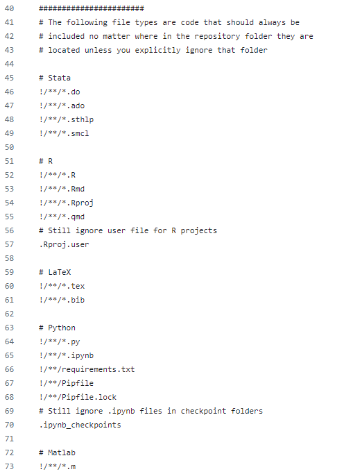{fig-align="center"}
:::
::::

# Other files than code - Data

## What about data?

:::: {.columns .v-center-container}

::: {.column width="10%" .v-center-container}
:::

::: {.column width="80%"}

Most data formats are binary. For example: `.dta` or `.rdata`.

Some data formats (ex. `.csv`) are raw text, and can be tracked efficiently. However, GitHub is only graded for public data and frequent edits to raw text data can still create very large clones.

Therefore, our recommendation is simply: _Git and GitHub is for code, not data_. 

But where should we save and share data? We have identified three methods.

DIME Analytics is happy to meet with DIME teams and discuss what method is best for them and help with setup.

:::

::: {.column width="10%" .v-center-container}
:::
::::

## Data Method 1 - Manual add to clone

:::: {.columns .v-center-container}
::: {.column width="80%"}

_Example use case:_ Government counterpart shares secondary data at the beginning of the project that will not change.

First, store data in backup. From there each collaborator manually copies the data to the clone. 

Make sure that data folders or data formats are ignored.

:::: {.columns}
::: {.column width="45%"}
_Pros:_

- Simple, requires no technical setup
:::

::: {.column width="5%"}
:::

::: {.column width="45%"}
_Cons:_

- Require a manual setup for each user
- Risk for outdated data if data changes
- Each team member wanting result files needs to run the code

:::
::::

:::

::: {.column width="20%"}
{fig-align="center"}
:::
::::

## Data Method 2 - APIs

:::: {.columns .v-center-container}
::: {.column width="80%"}

_Example use case:_ Any project where the code fetches the data through APIs or in other ways handled fully in the code.

Write an API call in the code that loads the data into working memory or saves it to file.

If data is saved in the clone, make sure that data folders or data formats are ignored.

:::: {.columns}  
::: {.column width="45%"}
_Pros:_

- Automatic after technical setup
- Data kept up-to-date as needed
:::

::: {.column width="5%"}
:::

::: {.column width="45%"}
_Cons:_

- Far from all data comes from APIs
- Each team member wanting result files needs to run the code
:::
::::

:::
::::


## Data Method 3 - Multi-roots

:::: {.columns .v-center-container}
::: {.column width="85%"}

_Example use case:_ A catch-all method that can be used for all projects.

Share code and data in different folders. For example, keep using OneDrive/SharePoint for data sharing.

Add multiple roots paths in your code. One path that points to data and one that points to code in the clone. Use root globals or a command like `reproot` in DIME Analytics Stata package `repkit`.

If intermediate data is saved to the Git folder, make sure that data folders or data formats are ignored.

:::: {.columns}  
::: {.column width="45%"}
_Pros:_

- Data kept up-to-date as needed
- Results and outputs can be viewed by members who did not read the code
:::

::: {.column width="5%"}
:::

::: {.column width="45%"}
_Cons:_

- Requires root path setup.
- Requires granting access to both repo and other sharing tool.
:::
::::

:::

::: {.column width="5%"}
:::

::: {.column width="10%"}
{fig-align="center"}
:::
::::

# Other files than code - Outputs

## Raw text tables


:::: {.columns .v-center-container}
::: {.column width="40%"}

Tables in raw text formats --- such as `.tex`, `.csv`, or `.md` --- works perfectly to version control in Git.

This allows you to be fully aware of when changes in your code cause changes in your outputs.

See this example [here](https://github.com/dime-wb-trainings/prwp-ttl/commit/05d71bce58f4c2d6cbc55b02c0b6666aa9273427).

:::

::: {.column width="60%"}

{fig-align="center"}
:::
::::

## Visualizations

Many graph types can also be version controlled - but less precisely. Visual comparisons before committing is only possible in GUI clients.

Changes in meta data can make Git identify a difference that is not a difference in the data visualization. See this example [here](https://github.com/dime-wb-trainings/prwp-ttl/commit/aac0f19be1de5f72b4e1ab99f1e4cf524d3e4469).

Therefore, if Git identifies no difference, then the new graph is identical to the one already on the repository. However, when Git identifies a difference, it might just be the meta data that differs, and the data visualization is still identical.

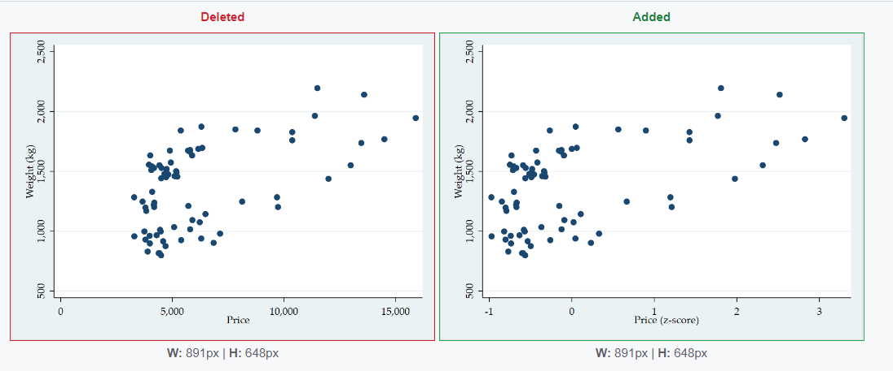{fig-align="center"}


# Other great GitHub features

## Issues

:::: {.columns .v-center-container}
::: {.column width="50%"}

Can be used as feedback or bug reports, but is in research most commonly used for tasks.

Especially good for tasks without an obvious solution as each issue has a space for discussions.

Commits and merges can be tagged with the issue number showing that it is part of addressing this issue.

See example [here](https://github.com/worldbank/ietoolkit/issues/347).

:::

::: {.column width="50%"}
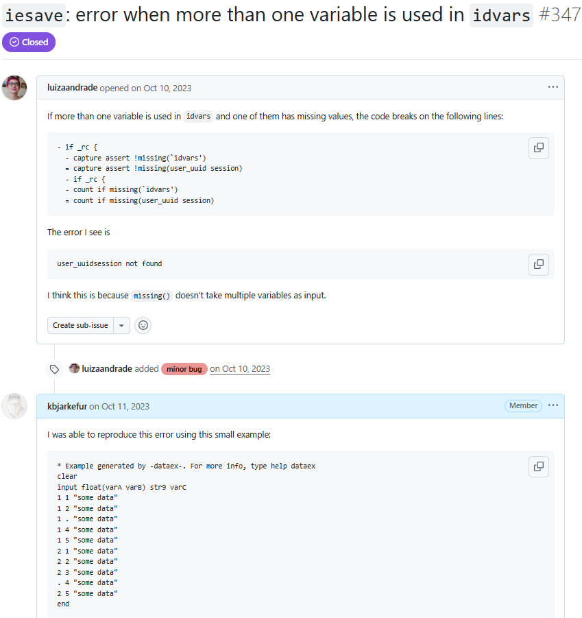{fig-align="center"}
:::
::::

## Blame

:::: {.columns .v-center-container}
::: {.column width="50%"}

Have you ever spent hours looking at and trying to figure out old code?

Crudely named but excellent tool for this use case.

Blame gives you who was the last person to edit a line and when. Click on the commit to also see what other edits were done at the same time.

After clicking the commit, you can browse project code at that state and see what was done before and after.

See example [here](https://github.com/worldbank/repkit/blame/main/src/ado/reprun.ado).

:::

::: {.column width="50%"}
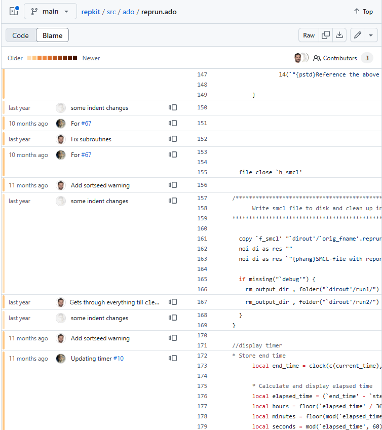{fig-align="center"}
:::
::::

# Thank you! Questions?

I also welcome at this point other TTLs to share their experiences on migrating to and using Git/GitHub!


* Repository with source file for these slides here: https://github.com/worldbank/dime-github-trainings
